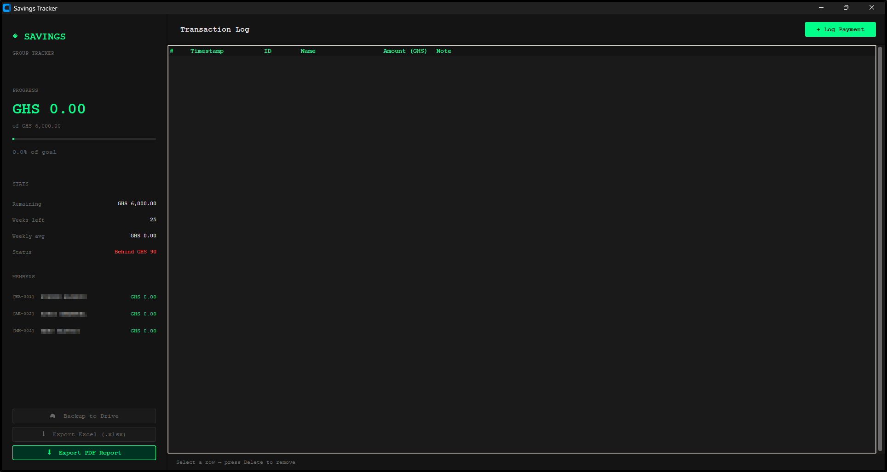
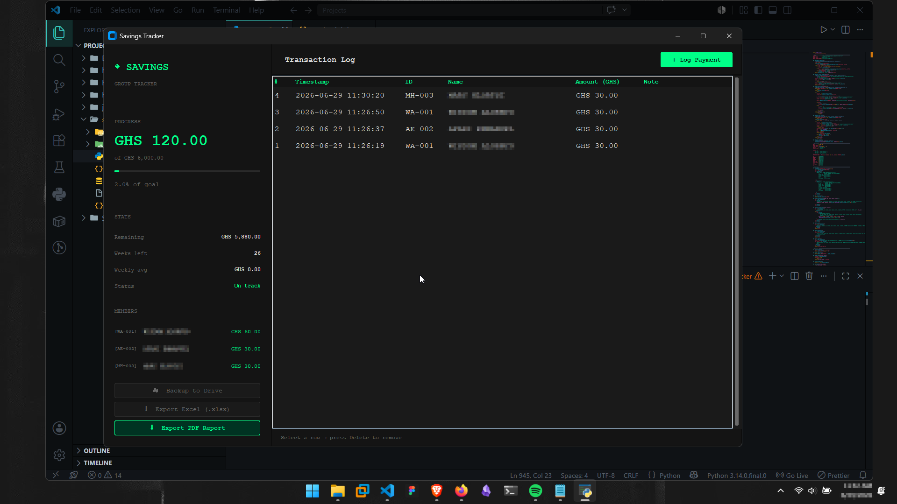

# Group Savings Tracker

A local desktop app I built in Python to track a private group savings goal. No cloud database, no subscription, just a lightweight tool that keeps our records straight and backs itself up automatically.

## Why I built this

A few of us started a savings goal together and needed a simple way to log contributions, see progress at a glance, and keep an audit trail of who added or removed what. Spreadsheets got messy fast, so I built a proper interface for it instead.

## Features

- **Member tracking** — dropdown to select who's making a transaction
- **Audit logging** — every transaction and deletion gets logged, so there's always a record of who did what and when
- **Progress bar** — visual view of how close the group is to the savings goal
- **Export options** — generate PDF or Excel reports of all transactions
- **Auto-backup** — syncs to Google Drive automatically, with restore support if anything goes wrong locally

## Tech stack

- **Python** with **CustomTkinter** for the interface
- **SQLite** for local data storage
- **ReportLab** for PDF generation
- **openpyxl** for Excel export
- **Google Drive API** for backup and restore

## Screenshots

<!-- Add screenshots here -->

## Status

Built and running for personal use. Currently tracking a savings goal that started July 2026 for a small fixed group of members.

## Notes

This was built for a specific private use case rather than as a general-purpose product, so some values (like member names and goal dates) are hardcoded rather than configurable through the UI. Future versions could open that up if there's demand.
